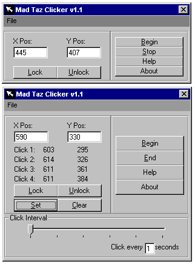



## Simple mouse clicker macro with 2 modes

### Description

There's two setting types, the basic mode and 4x mode. Basic mode allows the user to lock 1 point on the screen and have the program repeatedly click it until told not to. 4x mode lets the user select 4 up to points to click and choose the intervals between the clicks. Then the program will cycle through and click all the points until told to stop.
 
### More Info
 

             |
---                |---
**Submitted On**   |2004-02-21 12:17:42
**By**             |[tazrockon](https://github.com/Planet-Source-Code/PSCIndex/blob/master/ByAuthor/tazrockon.md)
**Level**          |Beginner
**User Rating**    |5.0 (10 globes from 2 users)
**Compatibility**  |VB 6\.0
**Category**       |[Complete Applications](https://github.com/Planet-Source-Code/PSCIndex/blob/master/ByCategory/complete-applications__1-27.md)
**World**          |[Visual Basic](https://github.com/Planet-Source-Code/PSCIndex/blob/master/ByWorld/visual-basic.md)
**Archive File**   |[Simple\_mou1711602212004\.zip](https://github.com/Planet-Source-Code/tazrockon-simple-mouse-clicker-macro-with-2-modes__1-51918/archive/master.zip)

